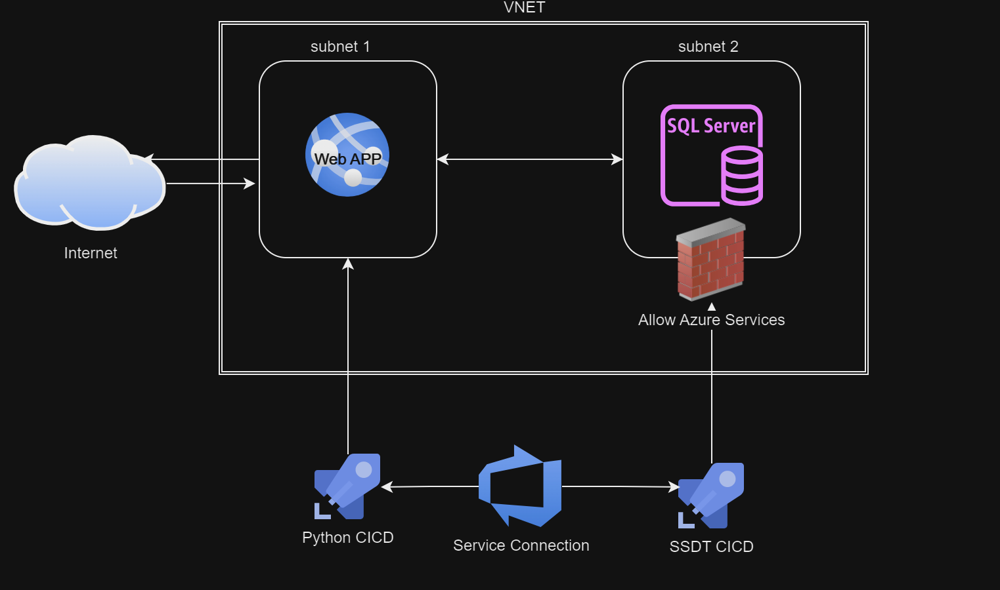

# Restaurants Project
An API for managing and searching restaurant data. This solution is designed to streamline database initialization and provide flexible search functionalities, including filtering restaurants based on various criteria or by name.
It is an example of how to build and deploy API, SSDT and Terraform for Azure with Azure devops Pipelines.

## Key Features:
* Database Management: Utilize SQL Server Data Tools (SSDT) for seamless database creation and deployment.
* Infrastructure as Code: Automate the deployment process to Azure using Terraform for a scalable and reliable solution.
* Search Capabilities: Quickly find restaurants using a variety of filters or by their specific names.

This repository provides everything needed to deploy, manage, and extend the API within Azure environments.


## TOC
- [API](#Restaurant-API)
- [SSDT](#SSDT)
- [Terraform](#Terraform)


## Restaurant API
This is a RESTful API for managing and searching restaurant data. The API provides functionality to initialize the database, search for restaurants based on various criteria, and specifically search by restaurant name.

### Features 
* Initialization: Ensure necessary database tables (restaurants, search_history) are created.
* Restaurant Search: Search for restaurants that are open at the time of the search with optional filters like name, style, vegetarian options, and delivery service.
* Name Search: Search for a restaurant by its name.

### Endpoints
#### GET /search
Search for restaurants that are currently open. Optional query parameters allow for filtering by name, style, vegetarian options, and delivery service.
#### query parameters
* restaurant_name (string, optional): The name of the restaurant.
* restaurant_style (string, optional): The style of cuisine (e.g., Italian, Chinese).
* vegetarian (boolean, optional): Whether the restaurant offers vegetarian options.
* deliveries (boolean, optional): Whether the restaurant offers delivery service.

```bash
GET /search?restaurant_name=Pizza&vegetarian=true&delivery=true
```

#### GET /searchByRest
Search for a restaurant by its name.
#### query parameters
* restaurant_name (string): The name of the restaurant.

```bash
GET /searchByRest?restaurant_name=Pizza
```

#### POST /add_restaurant
Add one record to the restaurant table. Remove it in production! Its only for testing purposes.
Use the SSDT CI/CD to add unlimited records. 
#### query parameters
* restaurant_name (string, require): The name of the restaurant.
* restaurant_style (string, require): The style of cuisine (e.g., Italian, Chinese).
* vegetarian (boolean, require): Whether the restaurant offers vegetarian options.
* deliveries (boolean, require): Whether the restaurant offers delivery service.
* timeOpen (string, require) The time that the restaurant open.
* timeClose (string, require) The time that the restaurant close .


```bash
curl -u admin:securepassword -X POST -H "Content-Type: application/json" -d '{"restaurantName": "Hummus Sababa"}' http://{app}/add_restaurant
```

#### Future Enhancements
* RabbitMQ Integration: If time permits, integrating RabbitMQ to push data to the SQL database would be beneficial.
* SQL for Logs: Instead of traditional logs or blob tables, the API uses SQL to trace logs, allowing for easier data analysis by SQL experts. We can change it if require.
* Frontend Application: Adding a frontend to send requests to the API and placing the API within the SQL subnet for better integration and security.
* Error Handling - Currently, backend errors are being displayed.

## SSDT 
SQL Server Data Tools (SSDT) is an integrated development environment (IDE) provided by Microsoft for managing and developing SQL Server databases. SSDT is built into Visual Studio, allowing developers to create, design, and deploy databases, database-related projects, and business intelligence solutions.


### Here’s how it works
In the DevOps CI/CD aspect, SQL Server Data Tools (SSDT) integrates seamlessly to manage and automate database deployments. Here’s how it works:

1. Version Control Integration
Source Control: Store your SSDT database project in a version control system (e.g., Git).
Tracking Changes: Track changes to database schemas and scripts in the same way you manage application code.
2. Build Automation
Build Pipelines: Set up CI pipelines in tools like Azure DevOps to automatically build the SSDT project.
DACPAC Generation: The build process generates a DACPAC file, a package containing the database schema.
3. Testing
Automated Tests: Incorporate unit tests and integration tests for database objects into the CI pipeline to validate changes.
4. Deployment Automation
Release Pipelines: Use CD pipelines to deploy the DACPAC file to target SQL Server instances.
Incremental Deployment: SSDT ensures incremental deployment, applying only the changes necessary to update the target database to match the DACPAC.
5. Rollback and Rollforward
Versioned Releases: Manage rollbacks by keeping track of previous DACPAC versions.
Deployment Scripts: Automatically generated deployment scripts can be reviewed and adjusted as needed.
6. Configuration Management
Environment Configuration: Use variables and configuration files to manage environment-specific settings (e.g., connection strings, database names).
Summary
SSDT in DevOps CI/CD provides a robust framework for automating database deployments, ensuring consistency, and integrating database changes seamlessly with application deployments. This integration supports continuous integration and continuous delivery practices, enhancing the overall 

## instructions
- the table schema location: /sqlproject/DatabaseProjectrestaurantdb/dbo 
- post deployment script location: /sqlproject/DatabaseProjectrestaurantdb/script

- In the SSDT build (ci) the sqlproj,the schema of the tables and the post deployment script will compile and produce a DACPAC file.
<br/>
- In the release pipeline the DACPAC file will be deploy to azure sql server and will sync the schema change if there is one
<br />
- The post deployment script will execute without sync so beware of duplications.
### When you want to insert more record, clean the PostDeploymentScript.sql and fill it with your records.

## Terraform



<!-- BEGIN_TF_DOCS -->
### Requirements

| Name | Version |
|------|---------|
| <a name="requirement_azurerm"></a> [azurerm](#requirement\_azurerm) | =3.65.0 |

### Providers

| Name | Version |
|------|---------|
| <a name="provider_azurerm"></a> [azurerm](#provider\_azurerm) | 3.65.0 |
| <a name="provider_random"></a> [random](#provider\_random) | 3.6.2 |


### Resources

| Name | Type |
|------|------|
| [azurerm_linux_web_app.app](https://registry.terraform.io/providers/hashicorp/azurerm/3.65.0/docs/resources/linux_web_app) | resource |
| [azurerm_mssql_database.sql_database](https://registry.terraform.io/providers/hashicorp/azurerm/3.65.0/docs/resources/mssql_database) | resource |
| [azurerm_mssql_server.sql_server](https://registry.terraform.io/providers/hashicorp/azurerm/3.65.0/docs/resources/mssql_server) | resource |
| [azurerm_private_dns_a_record.sql_dns_a_record](https://registry.terraform.io/providers/hashicorp/azurerm/3.65.0/docs/resources/private_dns_a_record) | resource |
| [azurerm_private_dns_zone.sql_private_dns_zone](https://registry.terraform.io/providers/hashicorp/azurerm/3.65.0/docs/resources/private_dns_zone) | resource |
| [azurerm_private_dns_zone_virtual_network_link.sql_dns_link](https://registry.terraform.io/providers/hashicorp/azurerm/3.65.0/docs/resources/private_dns_zone_virtual_network_link) | resource |
| [azurerm_private_endpoint.sql_private_endpoint](https://registry.terraform.io/providers/hashicorp/azurerm/3.65.0/docs/resources/private_endpoint) | resource |
| [azurerm_resource_group.rg](https://registry.terraform.io/providers/hashicorp/azurerm/3.65.0/docs/resources/resource_group) | resource |
| [azurerm_service_plan.asp](https://registry.terraform.io/providers/hashicorp/azurerm/3.65.0/docs/resources/service_plan) | resource |
| [azurerm_sql_firewall_rule.azureservicefirewall](https://registry.terraform.io/providers/hashicorp/azurerm/3.65.0/docs/resources/sql_firewall_rule) | resource |
| [azurerm_subnet.sql_subnet](https://registry.terraform.io/providers/hashicorp/azurerm/3.65.0/docs/resources/subnet) | resource |
| [azurerm_subnet.subnet](https://registry.terraform.io/providers/hashicorp/azurerm/3.65.0/docs/resources/subnet) | resource |
| [azurerm_virtual_network.vnet](https://registry.terraform.io/providers/hashicorp/azurerm/3.65.0/docs/resources/virtual_network) | resource |
| [random_password.sqlpassword](https://registry.terraform.io/providers/hashicorp/random/latest/docs/resources/password) | resource |

### Inputs
#### APP_PASS AND APP_USER IS ONLY FOR DEVELOPMENT USE! remove them in production or make another variable.tf for production.
#### Use it to insert a single record to the database with the secure endpoint in the app for development purposes only (see app documentation)
#### For production and to insert unlimited records - use the SSDT CI/CD flow
| Name | Description | Type | Default | Required |
|------|-------------|------|---------|:--------:|
| <a name="input_APP_PASS"></a> [APP\_PASS](#input\_APP\_PASS) | application password to add record the database. | `string` | `"psdfm@lfo3asd5fko9asdk"` | no |
| <a name="input_APP_USER"></a> [APP\_USER](#input\_APP\_USER) | application user to add record the database | `string` | `"adminoren"` | no |
| <a name="input_resource_group_location"></a> [resource\_group\_location](#input\_resource\_group\_location) | resource group location | `string` | `"West Europe"` | no |
| <a name="input_resource_group_name"></a> [resource\_group\_name](#input\_resource\_group\_name) | The name of the resource group | `string` | `"restaurant-recommendation-rg"` | no |
| <a name="input_web_app_name"></a> [web\_app\_name](#input\_web\_app\_name) | name of the web app | `string` | `"restaurant-api-app-dev1"` | no |

### Outputs

| Name | Description |
|------|-------------|
| <a name="output_mssql_admin_password"></a> [mssql\_admin\_password](#output\_mssql\_admin\_password) | The MSSQL server password |
<!-- END_TF_DOCS -->